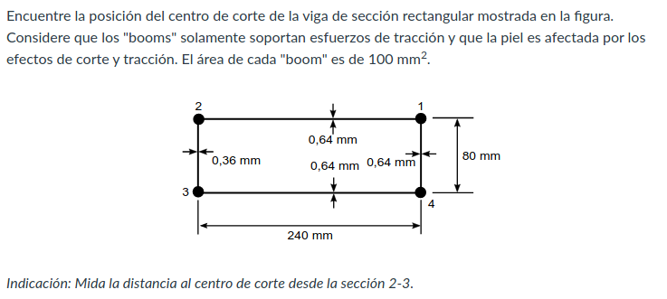

$I_(x x) = 1.17 * 10^6[mm^4]$

$q_S = -S_y/I_(x x) [int_0^s t_D * y * ds + sum_(r=1)^n B_r * y_r]$

$q_(b,01) = -S_y/I_(x x) int_0^(s_1) 0.64[mm] * s_1 * ds_1$

$=> -S_y/I_(x x) * 0.32[mm] * s_1^2 = -S_y * 2.735 * 10^-7 [mm^-3] * s_1^2$

$q_(b,12) = -S_y/I_(x x) [int_0^(s_2) (0.64[mm] * 40[mm] * ds_2) + 100[mm^2] * 40[mm]] + q_(b,01)$

$=> -S_y/I_(x x) [25.6[mm^2] * s_2 + 4000[mm^3]] + q_(b,01)$

$=> -S_y (2.188 * 10^-5[mm^-2] * s_2 + 3.418 * 10^-3 [mm^-1]]) + q_(b,01)$

$q_(b,23) = -S_y/I_(x x) [int_0^(s_3) (0.36[mm] * (40[mm] - s_3) * ds_3) + 100[mm^2] * 40[mm]] + q_(b,12)$

$=> -S_y/I_(x x) {14.4[mm^2] * s_3 - s_3^2 * 0.18[mm] + 4000[mm^3]} + q_(b,12)$

$=> -S_y (1.230 * 10^-5[mm^-2] * s_3 - s_3^2 * 1.538 * 10^-7[mm^-3] + 3.418 * 10^-3 [mm^-1]) + q_(b,12)$

$oint(q_b//t) ds = 2(1/0.64 oint_0^40 q_(b,01)ds_1 + 1/0.64 oint_0^240 q_(b,12)ds_2 + 1/0.36 oint_0^40 q_(b,23) ds_3)$

$oint_0^40 q_(b,01)ds_1 = -S_y * 2.735 * 10^-7 [mm^-3] * (40[mm])^2 $

$=> -S_y * 4.376 * 10^-4[mm^-1]$

$oint_0^240 q_(b,12)ds_2 = -S_y (2.188 * 10^-5[mm^-2] * s_2 + 3.418 * 10^-3 [mm^-1]) + q_(b,01)$

$=> -S_y (2.188 * 10^-5[mm^-2] * 240[mm] + 3.418 * 10^-3 [mm^-1]) + q_(b,01)$

$=> -S_y * 8.669 * 10^-3[mm^-1] - S_y * 4.376 * 10^-4[mm^-1]$

$=> -S_y * 9.106 * 10^-3[mm^-1]$

$oint_0^40 q_(b,23) ds_3 = -S_y (1.230 * 10^-5[mm^-2] * s_3 - s_3^2 * 1.538 * 10^-7[mm^-3] + 3.418 * 10^-3 [mm^-1]) + q_(b,12)$

$=> -S_y (1.230 * 10^-5[mm^-2] * 40[mm] - (40[mm])^2 * 1.538 * 10^-7[mm^-3] + 3.418 * 10^-3 [mm^-1])$

$-S_y * 9.106 * 10^-3[mm^-1]$

$=> -S_y * 5.442 * 10^-3[mm^-1]$

$oint(q_b//t) ds = 2 * -S_y ((4.376 * 10^-4[mm^-1]) / (0.64[mm]) + (9.106 * 10^-3[mm^-1]) / (0.64[mm]) + (5.442 * 10^-3[mm^-1])/(0.36[mm]))$

$=> 2 * -S_y (6.836 * 10^-4 + 1.422 * 10^-2 + 1.511 * 10^-2)[mm^-2]$

$=> -S_y * 6.002 * 10^-2[mm^-2]$

$oint(ds//t) = 2(1/0.64 oint_0^40 ds_1 + 1/0.64 oint_0^240 ds_2 + 1/0.36 oint_0^40 ds_3)$

$=> 2 * (40/0.64 + 240/0.64 + 40/0.36)$

$=> 1.097 * 10^3$

${:oint(q_b//t) ds:}/{: oint(ds//t) :} = (-S_y * 6.002 * 10^-2) / (1.097 * 10^3) = -S_y * 5.471 * 10^-5$

$q_(b_01) + q_(s0) = -S_y (4.376 * 10^-4 + 5.471 * 10^-5) = -S_y * 4.923 * 10^-4$

$q_(b_12) + q_(s0) = -S_y (9.106 * 10^-3 + 5.471 * 10^-5) = -S_y * 9.160 * 10^-3$

$q_(b_23) + q_(s0) = -S_y (5.442 * 10^-3 + 5.471 * 10^-5) = -S_y * 5.496 * 10^-3$

$S_y * epsilon = 2 * [-int_0^40 q_01 * 240 * ds_1 - int_0^240 * q_12 * 40 * ds_2]$