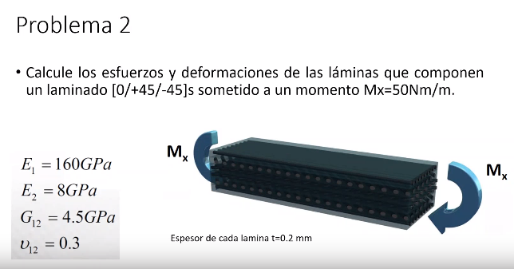

##Problema 2



###a) Deformacion en eje estructural

En laminas se aplica que

$v_12 / E_1 = v_21 / E_2 => 0.3 / (160[GPa]) = v_21 / (8[GPa]) => v_21 = 0.015$

$[Q]=
[
	[E_1 / (1 - v_12 * v_21), (v_12 * E_2) / (1 - v_12 * v_21), 0
	],
	[(v_12 * E_2) / (1 - v_12 * v_21), E_2 / (1 - v_12 * v_21), 0
	],
	[0, 0, G_12
	]
]
=
[
	[160.72, 2.41, 0
	],
	[2.41, 8.04, 0
	],
	[0, 0, 4.5
	]
][GPa]
$

```javascript
E1 = 160;
E2 = 8;
G12 = 4.5;
v12 = 0.3;
v21 = 0.015;
Q = [
	[E1/(1-(v12*v21)), v12*E2/(1-v12*v21), 0];
	[v12*E2/(1-v12*v21), E2/(1-(v12*v21)), 0];
	[0, 0, G12]
]
```

Rotar Q para 45 y -45

$[Q]_45 = [T]_45^-1 * [Q] * [T']_45 = 
[
	[47.895, 38.895, 38.171
	],
	[38.895, 47.895, 38.171
	],
	[38.171, 38.171, 40.984
	]
][GPa]
$

```javascript
a = deg2rad(45);
T = [
    [cos(a)^2, sin(a)^2, 2*cos(a)*sin(a)];
    [sin(a)^2, cos(a)^2, -2*sin(a)*cos(a)];
    [-cos(a)*sin(a), sin(a)*cos(a), cos(a)^2-sin(a)^2]
];

T_prima = [
    [cos(a)^2, sin(a)^2, cos(a)*sin(a)];
    [sin(a)^2, cos(a)^2, -sin(a)*cos(a)];
    [-2*cos(a)*sin(a), 2*sin(a)*cos(a), cos(a)^2-sin(a)^2]
];

Q_45 = inv(T) * Q * T_prima
```

$[Q]_text(-45) = [T]_text(-45)^-1 * [Q] * [T']_text(-45) = 
[
	[47.895, 38.895, -38.171
	],
	[38.895, 47.895, -38.171
	],
	[-38.171, -38.171, 40.984
	]
][GPa]
$

$[[N], [M]] = [[A, B], [B, D]] [[epsilon], [k]]$

Como es laminado simetrico

$[[N], [M]] = [[A, cancel(B)], [cancel(B), D]] [[epsilon], [k]]$

No existen fuerzas normales

$[[cancel(N)], [M]] = [[cancel(A), cancel(B)], [cancel(B), D]] [[cancel(epsilon)], [k]]$

Entonces

$[M] = [D][k]$

$[D] = sum_(k=1)^n(h_k^3-h_(k-1)^3)/3[Q]_k = 
[
	[1.83 * 10^-8, 1.90 * 10^-9, 1.22 * 10^-9
	],
	[1.90 * 10^-9, 2.86 * 10^-9, 1.22 * 10^-9
	],
	[1.22 * 10^-9, 1.22 * 10^-9, 2.20 * 10^-9
	]
][GPa*m^3]$

```javascript
#Ordenar laminas desde abajo hacia arriba
C = {Q, Q_45, Q_m45, Q_m45, Q_45, Q};
n = 6; #Cuantas laminas
t = 0.0002; #Grosor
D=zeros(3);
for i=1:n
  z = -(n / 2) * t + i * t;
  z_m1 = z - t;
  D = D + ((z^3 - z_m1^3)/3*cell2mat(C(i)));
endfor
D
```

$[M][(Nm)/m] = [D][GPa*m^3][k]$

$[M][(kg * m^2)/(s^2 * m)] = [D][(kg)/(m*s^2) * m^3] * 10^9[k]$

$[M] = [D][m] * 10^9[k]$

$1/(10^9) * [D]^-1 [M] [1/m] = [k] = [[2.95],[-1.66],[-0.71]][1/m]$

```javascript
k = 10^-9*inv(D)*[50;0;0]
```
$epsilon^text(total) = epsilon^text(normal) + z * k$

$[epsilon] = z[m] * [[2.95],[-1.66],[-0.71]][1/m]$

###b) Esfuerzo eje estructural

$[sigma]_k = [Q]_k * [epsilon]$