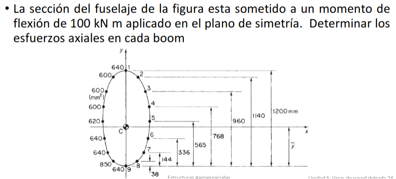

Area de cada boom

Boom|Area [mm^2]|y[mm]
-|-|-
1|640|1200
2|600|1140
3|600|960
4|600|768
5|620|565
6|640|336
7|640|144
8|850|38
9|640|0

El momento de $100 [kN * m]$ esta en el eje x

El objetivo es calcular el esfuerzo en cada boom

Primero se necesita calcular el centroide ponderado, como el material de todos los boom es el mismo se simplifica el calculo

$sum A_i * y_i = 3178600 [mm^3]$

$sum A_i = 5830 [mm^2]$

${:sum A_i * y_i:} / {: sum A_i :} = 545[mm]$

Encontrar momentos de inercia de cada boom

$I_(x x_i) = A_i * y_i^2$

Boom|$y_i$|$I_(x x_i)$
-|-|-
1|655|274.576e6
2|595|212.415e6
3|415|103.335e6
4|223|29.8374e6
5|20|248e3
6|-209|27.95584e6
7|-401|102.91264e6
8|-507|218.49165e6
9|-545|190.096e6

$sum I_(x x_i) = 1160 * 10^6 [mm^4]$