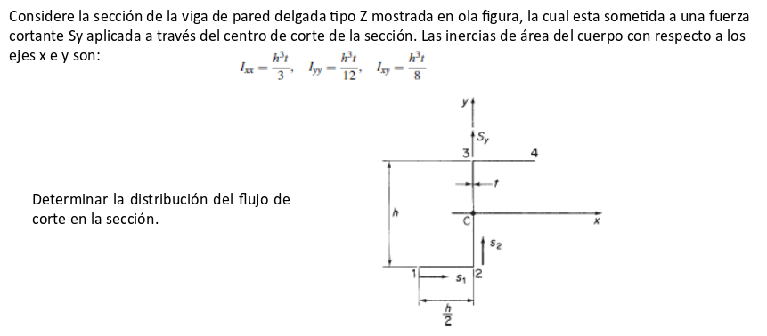
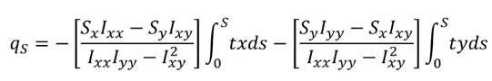

Simplificar ecuacion general de flujo

No hay fuerza $S_x$

$q_S = -[{: -S_y I_(x y):} / {: I_(x x) I_(y y) - I_(x y)^2 :}] int_0^S tx ds -[{: S_y I_(y y):} / {: I_(x x) I_(y y) - I_(x y)^2 :}] int_0^S ds$

$q_S = [{: S_y I_(x y):} / {: I_(x x) I_(y y) - I_(x y)^2 :}] int_0^S tx ds -[{: S_y I_(y y):} / {: I_(x x) I_(y y) - I_(x y)^2 :}] int_0^S ty ds$

$q_S = S_y / {: I_(x x) I_(y y) - I_(x y)^2 :} (I_(x y) int_0^S tx ds - I_(y y) int_0^S ty ds)$

$q_S = S_y / {: (h^3 t)^2 / 36 - (h^3 t)^2 / 64 :} int_0^S ((h^3 t^2) / 8 x - (h^3 t^2) / 12 y) ds$

$q_S = (S_y * h^3 t^2) / {: (h^3 t)^2 / 36 - (h^3 t)^2 / 64 :} int_0^S (1 / 8 x - 1 / 12 y) ds$

$q_S = S_y / {: h^3 / 36 - h^3 / 64 :} int_0^S (1 / 8 x - 1 / 12 y) ds$

$q_S = S_y / {: h^3 * 0.01215 :} int_0^S (1 / 8 x - 1 / 12 y) ds$

$q_S = (S_y * 82.30452) / {: h^3 :} int_0^S (1 / 8 x - 1 / 12 y) ds$

$q_S = S_y / {: h^3 :} int_0^S (10.288 * x - 6.858 * y) ds$

En el tramo 1 - 2 tenemos que $y = -h/2; x = -h/2 + s_1; 0 < s_1 < h/2$

$q_S = S_y / {: h^3 :} int_0^S (10.288 * (-h/2 + s_1) - 6.858 * -h/2) ds$

$q_S = S_y / {: h^3 :} int_0^S (10.288 * s_1 - 5.144 * h + 3.429 * h) ds$

$q_S = S_y / {: h^3 :} int_0^S (10.288 * s_1 -1.715 * h) ds$

$q_S = S_y / {: h^3 :} (5.144 * s_1^2 - 1.715 * h * s_1)$

