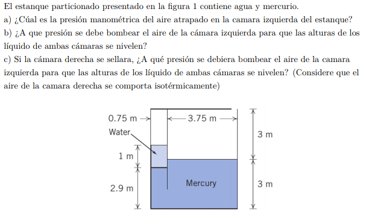
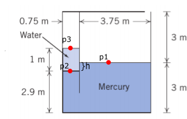
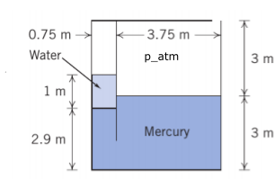
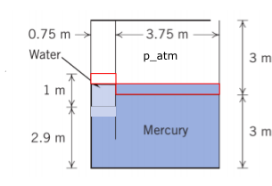
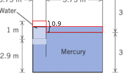
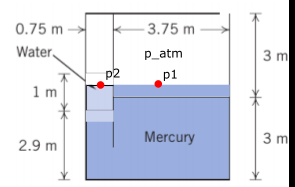
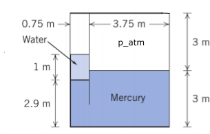
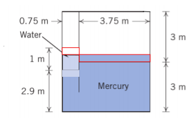
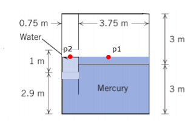

#Problema 1

##1)

$rho_1=rho_(atm)$

$rho_2=rho_1+0.1[m]*gamma_w$

$rho_3=rho_2-1[m]*gamma_w$

$rho_3=rho_(atm) + 0.1[m] * gamma_w - 1[m] * gamma_w$

$rho_3=rho_(atm) - 0.9[m] * gamma_w$

$rho_3=101325[Pa] - 0.9[m] * 9807[N/m^3]$

$rho_3=101325[Pa] - 8826.3[Pa]$

$rho_3=92498.7[Pa]$

##2) 

Estado inicial|Estado final
-|-
|

Los volumenes marcados en rojo deben ser los mismos

$V_(izq) = V_(der)$

$h_(izq) * w_(izq) * d_(izq) = h_(der) * w_(der) * d_(der)$

Profundidad es la misma $d_(izq) = d_(der)$

$h_(izq) * 0.75[m] = h_(der) * 3.75[m]$

Sacamos otra ecuación a partir de que conocemos la suma de $h_(izq)$ con $h_(der)$

$h_(izq) + h_(der) = 0.9[m]$

$(0.9[m] - h_(der)) * 0.75[m] = h_(der) * 3.75[m]$

$h_(der) = 0.15[m]$

$rho_1 + gamma_(Hg) * 1[m] - gamma_w * 1[m] = rho_2$

$rho_2 = 101325[Pa] + 133700[Pa] - 9807[Pa]$

$rho_2 = 225218[Pa]$

##3)

Estado inicial|Estado final
-|-
|

Encontrar nueva presión en el lado derecho, a partir de su comportamiento como gas ideal

$(rho * V)/(n * T) = R$

$(rho_0 * V_0)/(n_0 * T_0) = (rho_1 * V_1)/(n_1 * T_1)$

$(rho_(atm) * V_0) / V_1 = rho_1$

$(rho_(atm) * h_0 * w_0 * d_0) / (h_1 * w_1 * d_1) = rho_1$

$(rho_(atm) * h_0) / h_1 = rho_1 // w_0 = w_1 vv d_0=d_1$

$(101325[Pa] * 3[m]) / (2.85[m]) = rho_1$

$rho_1 = 106658[Pa]$

$rho_1 + gamma_(Hg) * 1[m] - gamma_(w) * 1[m] = rho_2$

$rho_2 = 106658[Pa] + 133700[Pa] - 9807[Pa]$

$rho_2 = 230551[Pa]$
