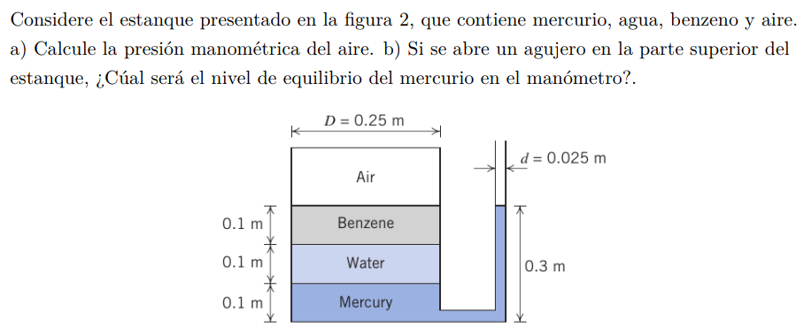
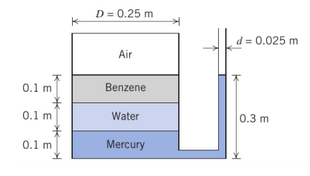
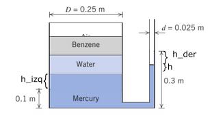

#Problema 2

##1)

$p_(air) + gamma_(Be) * 0.1[m] + gamma_w * 0.1[m] - gamma_(Hg)*0.2 = p_(atm)$

$SG_(Be) = 0.876$

$gamma_(Be) = 0.876 * 1000[(kg)/m^3] * 9.8[m/s^2] = 8584.8[N/m^3]$

$SG_(Be) = 13.56$

$gamma_(Hg) = 13.56 * 1000[(kg)/m^3] * 9.8[m/s^2] = 132888[N/m^3]$

$p_(air) + 8584.8[N/m^3] * 0.1[m] + 9800[N/m^3] * 0.1[m] - 132888[N/m^3] * 0.2[m] = 101325[Pa]$

$p_(air) = 101325[Pa] + 24739.2[Pa]$

$p_(air) = 126064.2[Pa]$

##2)

$gamma_(Be) * 0.1[m] + gamma_w * 0.1[m] = gamma_(Hg) * h$

$h$ es la diferencia que hay entre las alturas de mercurio

$(gamma_(Be) * 0.1[m] + gamma_w * 0.1[m]) / gamma_(Hg) = h$

$(8584.8[N/m^3] * 0.1[m] + 9800[N/m^3] * 0.1[m]) / (132888[N/m^3]) = h$

$h = 0.01384[m]$

Estado de referencia|Estado equilibrio
-|-
|

Volumenes con altura $h_(izq)$ y $h_(der)$ son iguales

$V_(izq) = V_(der)$

$h_(izq) * pi * (D/2)^2 = h_(der) * pi * (d/2)^2$

$h_(izq) * D^2 = h_(der) * d^2$

$h_(izq) * 0.0625[m^2] = h_(der) * 0.000625[m^2] // (1)$

$h_(izq) + h + h_(der) = 0.2[m]$

$h_(izq) + 0.01384[m] + h_(der) = 0.2[m]$

$h_(izq) + h_(der) = 0.18616[m] // (2)$

$(1)$ en $(2)$

$(h_(der) * 0.000625[m^2]) / (0.0625[m^2]) + h_(der) = 0.18616[m]$

$h_(der) = 0.18432[m]$

La altura del manometro es

$0.3[m] - h_(der)$

$0.3[m] - 0.18432[m]$

$0.11568[m]$

