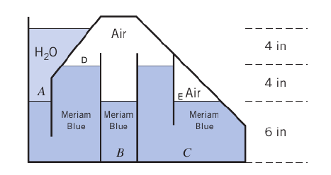

#Problema 3

$SG_(MB) = 1.75$

$gamma_(MB) = 1.75 * 9800[(kg)/m^3]$

Todas las presiones son absolutas

$p_A = p_(atm) + gamma_w * 8"$

$p_D = p_A - gamma_(MB) * 4"$

$p_B = p_D + gamma_(MB) * 6"$

$p_C = p_D + gamma_(MB) * 10"$

$p_E = p_D + gamma_(MB) * 4"$
