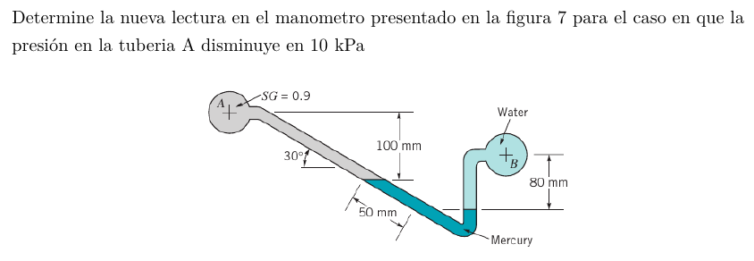

#Problema 6

Estado inicial

$p_A + gamma_A * 0.1[m] + gamma_(Hg) * 0.05[m] * sin(30) - gamma_w * 0.08[m] = p_B$

Estado final

$p_A' + gamma_A * (0.1[m] - Deltad * sin(30)) + gamma_(Hg) * (Deltad * sin(30) + 0.05[m] * sin(30) + Deltad) - gamma_w * (Deltad + 0.08[m])$

$ = p_B$

Igualar $p_B$

$p_A + gamma_A * 0.1[m] + gamma_(Hg) * 0.05[m] * sin(30) - gamma_w * 0.08[m] = $
$p_A' + gamma_A * (0.1[m] - Deltad * sin(30)) + gamma_(Hg) * (Deltad * sin(30) + 0.05[m] * sin(30) + Deltad) - gamma_w * (Deltad + 0.08[m])$

$Deltad = (-(p_A - p_A'))/(gamma_A * sin(30) - gamma_(Hg) * (sin(30) + 1) + gamma_w)$

$p_A - p_A' = 10000[Pa]$