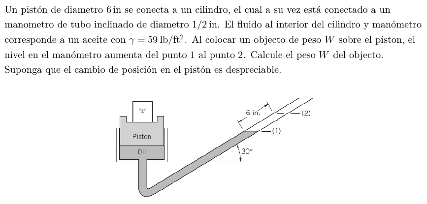

#Problema 7

Diferencia de presión

$Deltap = 59[(lb)/(ft^3)] * 0.5[ft] * sin(30)$

$Deltap = 14.75[(lb)/(ft^2)]$

La presión al lado izquierdo subio $Deltap$

Ese cambio es debido a que se agrega la fuerza del peso $W$

$Deltap = W/A$

$Deltap * A = W$

$14[(lb)/(ft^2)] * pi * ((0.5[ft])/2)^2 = W$

$W = 2.75[lb]$
