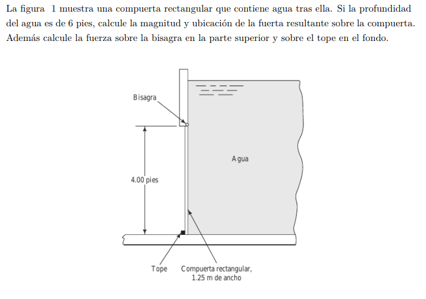
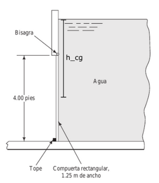

#Problema 1

Fuerza sobre la compuerta corresponde a la presión en el centro de gravedad por area de la superficie

$h_(cg) = 4[ft] = 1.22[m]$

$p_(cg) = gamma_w * h_(cg)$

$p_(cg) = 9800[N/m^3] * 1.22[m]$

$p_(cg) = 11956[N/m^2]$

$A = 1.25[m] * 1.22[m] = 1.525[m^2]$

$F = p_(cg) * A$

$F = 11956[N/m^2] * 1.525[m^2]$

$F = 18232.9[N]$

Centro de presión es donde actua la fuerza F

$y_(cp) = -gamma * sin(theta) * (I_(x x) / (p_(cg) * A))$

Compuerta

$I_(x x) = ((1.22[m])^3*(1.25[m]))/12 = 0.1892[m^4]$

$y_(cp) = -9800[N/m^3] * sin(90) * ((0.1892[m^4])/(18232.9[N]))$

$y_(cp) = -0.102[m]$

$y_R = y_(cg) + y_(cp)$

$y_R = 0.61[m] + 0.102[m]$

$y_R = 0.712[m]$

$sumM_(bisagra) = -F * y_R + F_(t o pe) * h = 0$

$sumM_(bisagra) = -18232.9[N] * 0.712[m] + F_(t o pe) * 1.22[m] = 0$

$F_(t o pe) = (18232.9[N] * 0.712[m])/(1.22[m])$

$F_(t o pe) = 10640.84[N]$

$sumM_(t ope) = F * (h - y_R) - F_(bisagra) * h = 0$

$sumM_(t ope) = 18232.9[N] * 0.508[m] - F_(bisagra) * 1.22[m] = 0$

$F_(bisagra) = (18232.9[N] * 0.508[m]) / (1.22[m])$

$F_(bisagra) = 7592.1[N]$