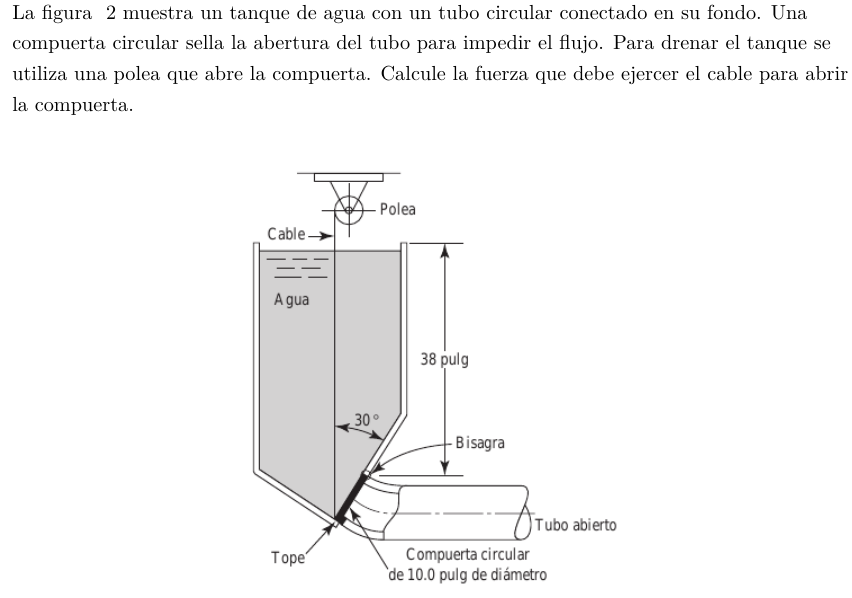

#Problema 2

Presión en centro de gravedad de compuerta

$h_(cg) = 38" + 5" * cos(30) = 42.33" = 1.075[m]$

$p_(cg) = gamma_w * h_(cg)$

$p_(cg) = 9800[N/m^3] * 1.075[m] = 10535[N/m^2]$

Fuerza del agua sobre compuerta

$A = pi * ((0.254[m])/2)^2 = 0.0506[m^2]$

$F = p_(cg) * A = 10535[N/m^2] * 0.0506[m^2] = 533.071[N]$

Centro de presión

$y_(cp) = -gamma * sin(theta) * (I_(x x)) / F$

$I_(x x) = pi / 4 * ((0.254[m])/2)^4 = 2.043 * 10^-4 [m^4]$

$y_(cp) = -9800[N/m^3] * sin(60) * (2.043 * 10^-4 [m^4]) / (533.071[N]) = -3.252 * 10^-3 [m]$

$y_R = y_(cg) + y_(cp)$

$y_R = ((0.254[m])/2) + 3.252 * 10^-3 [m] = 0.1303[m]$

$sumM_(bisagra) = F * y_R - F_(cabl e_x) * D = 0$

$sumM_(bisagra) = 533.071[N] * 0.1303[m] - F_(cabl e_x) * 0.254[m] = 0$

$(533.071[N] * 0.1303[m]) / (0.254[m]) = F_(cabl e_x)$

$F_(cabl e_x) = 273.46[N]$

$F_(cabl e_x) = F_(cabl e) * cos(60)$

$F_(cabl e_x) / cos(60) = F_(cabl e)$

$(273.46[N]) / cos(60) = F_(cabl e)$

$F_(cabl e) = 546.92[N]$
