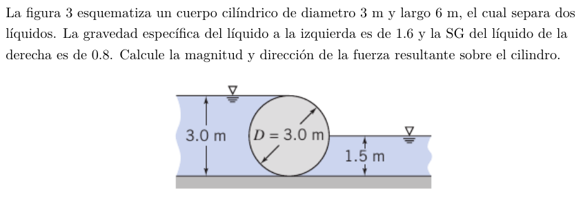

#Problema 3

###Fuerza vertical 

$V_(izq) = (pi * (1.5[m])^2) / 2 * 6[m] = 21.21[m^3]$

$F_(y_(izq)) = V_(izq) * gamma_(izq)$

$F_(y_(izq)) = 21.21[m^3] * 9800[N/m^3] * 1.6 = 332572.8[N]$

$V_(der) = (pi * (1.5[m])^2) / 4 * 6[m] = 10.60[m^3]$

$F_(y_(der)) = 10.60[m^3] * 9800[N/m^3] * 0.8 = 83104[N]$

$F_y = 332572.8[N] + 83104[N] = 415676.8[N]$

###Fuerza horizontal

Fuerza sobre proyección es

$F_x = p_(cg) * A$

$F_(x_(izq)) = 1.5[m] * 9800[N/m^3] * 1.6 * 18[m^2] = 423360[N]$

$F_(x_(der)) = 0.75[m] * 9800[N/m^3] * 0.8 * 9[m^2] = 52920[N]$