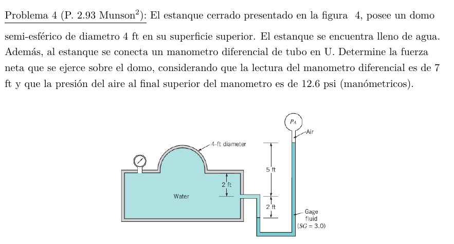

#Problema 4

Presión en base de domo

$p = 86873.94[Pa] + 9800[N/m^3] * 3 * 2.1336[m] - 9800[N/m^3] * 1.2192[m]$

$p = 137653.62[Pa]$

Area base de domo

$A = pi * ((1.2192[m])/2)^2 = 1.1675[m^2]$

Fuerza que ejerce el agua de base sobre volumen del domo

$F_p = p * A = 137653.62[Pa] * 1.1675[m^2] = 160710.6[N]$

Fuerza peso del agua en domo

$W = gamma_w * V$

$W = 9800[N/m^3] * 4/3 * pi * ((1.2192[m]) / 2)^3 * 1/2 = 4649.64[N]$

La fuerza sobre el domo es la resultante, eje y positivo hacia arriba

$F_(domo) = 160710.6[N] - 4649.64[N] = 156060.96[N]$