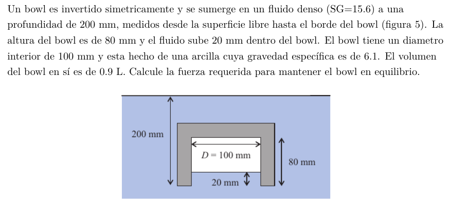

#Problema 5

La flotabilidad se conoce a partir del volumen desplazado

$V_(desp) = 0.0009[m^3] + pi * (0.05[m])^2 * 0.06[m] = 0.001371[m^3]$

$F_(flot) = 15.6 * 9800[N/m^3] * 0.001371[m^3] = 209.6[N]$

Peso de bowl

$W = 0.0009[m^3] * 6.1 * 9800[N/m^3] = 53.8[N]$

Fuerza necesaria para que el bowl se quede en equilibrio y no suba por la flotabilidad

$F = F_(flot) - W = 155.8[N]$