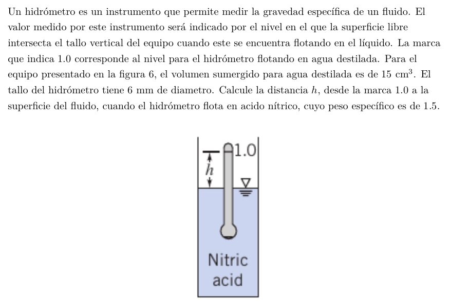

#Problema 6

Peso de hidrometro es igual a la flotabilidad de $15cm^3$ sumergidos en agua destilada

$W_(hidr) = 1.5 * 10^-5[m^3] * 9800[N/m^3] = 0.147[N]$

En acido nitrico, el peso del hidromero se iguala a la flotabilidad para alcanzar el equilibrio

Volumen desplazado en funcion de h

$V(h) = 1.5 * 10^-5[m^3] - pi * (0.003[m])^2 * h$

Flotabilidad en acido nitrico en funcion de h

El enunciado esta mal y 1.5 es la gravedad especifica, no el peso especifico

$F(h) = V(h) * 1.5 * 9800[N/m^3]$

Equilibrar peso del hidromero y flotabilidad

$F(h) - W_(hidr) = 0$

$(1.5 * 10^-5[m^3] - pi * (0.003[m])^2 * h) * 1.5 * 9800[N/m^3] - 0.147[N] = 0$

$h = 0.177[m]$