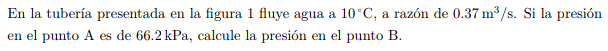
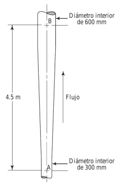

#Problema 1

Se relacionan los puntos A y B con Bernoulli

$p_A / gamma + 1/2 * v_A^2 / g + h_A = p_B / gamma + 1/2 * v_B^2 / g + h_B$

Con referencia en A entonces $h_A = 0$

$v_A = (pi * ((0.3[m])/2)^2)^-1 * 0.37[m^3/s] = 5.234[m/s]$

$v_B = (pi * ((0.6[m])/2)^2)^-1 * 0.37[m^3/s] = 1.309[m/s]$

$(66200[Pa]) / (9800[N/m^3]) + 1/2 * (5.234[m/s])^2 / (9.81[m/s^2]) = p_B / (9800[N/m^3]) + 1/2 * (1.309[m/s])^2 / (9.81[m/s^2]) + 4.5[m]$

$6.755[m] + 1.396[m] = p_B/(9800[N/m^3])+ 0.0873[m] + 4.5[m]$

$p_B = 34924.26[Pa]$