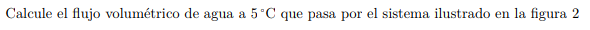
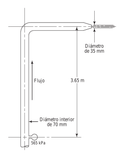

#Problema 2

Como el flujo volumetrico es constante se relaciona la velocidad en el punto donde conocemos la presión manometrica y en la salida, A y B respectivamente

$Q_A = Q_B$

$A_A * v_A = A_B * v_B$

$pi * ((0.07[m])/2)^2 * v_A = pi * ((0.035[m])/2)^2 * v_B$

$v_A = v_B * (3.06 * 10^-4[m^2])/(1.22 * 10^-3[m^2])$

$v_A = v_B * 0.25$

Bernoulli

$(565000[Pa])/(9800[N/m^3]) + 1/2 * ((v_B * 0.25)^2)/(9.8[m/s^2]) = 1/2 * ((v_B)^2)/(9.8[m/s^2]) + 3.65[m]$

$v_B = 33.601[m/s]$

$Q = v_B * A_B$

$Q = 33.601[m/s] * 3.06 * 10^-4[m^2] = 0.01028[m^3/s]$