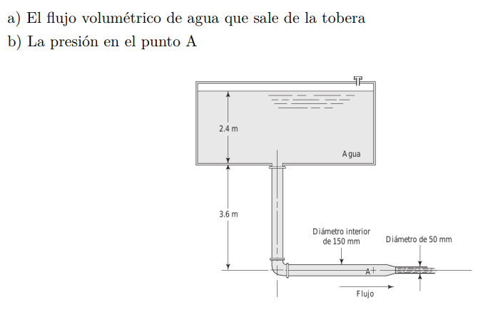

#Problema 3

Sacar velocidad en salida haciendo bernoulli en superficie agua y salida

$p_(s up) / gamma + 1 / 2 * (v_(s up))^2 / g + h_(s up) = p_(sal) / gamma + 1 / 2 * (v_(sal))^2 / g + h_(sal)$

Altura de referencia en salida

$h_(s up) = 1 / 2 * (v_(sal))^2 / g$

$6[m] = 1 / 2 * (v_(sal))^2 / (9.81[m/s^2])$

$v_(sal) = 10.85[m/s]$

Flujo

$Q = v_(sal) * A_(sal)$

$Q = 10.85[m/s^2] * pi * ((0.05[m])/2)^2 = 0.0213[m^3/s]$

Velocidad en A

$v_A = Q / A_A$

$v_A = (0.0213[m^3/s]) / (pi * ((0.150[m])/2)^2) = 1.205[m/s]$
