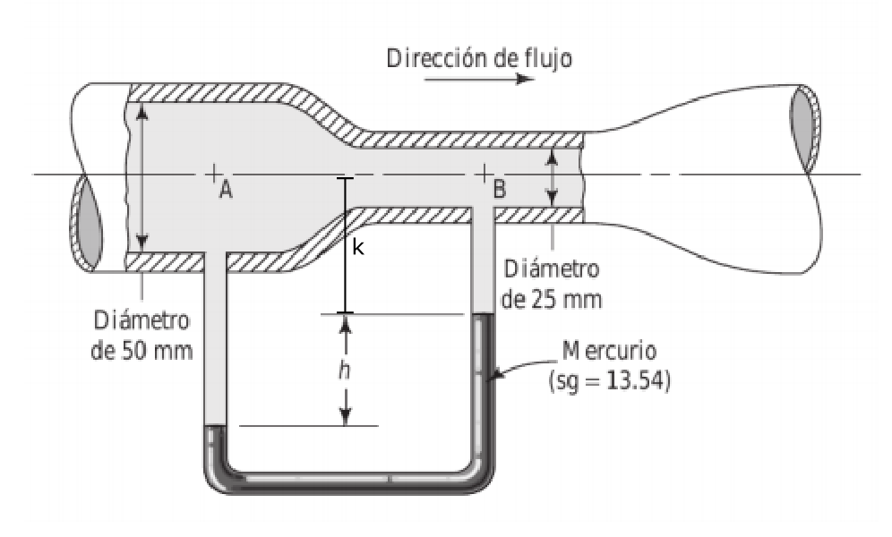

#Problema 5

Diferencia de presion

$p_A + gamma_w * k + gamma_w * h - gamma_(Hg) * h - gamma_w * k = p_B$

$p_B - p_A = gamma_w * h - gamma_(Hg) * h$

$p_B - p_A = 9800[N/m^3] * 0.250[m] - 13.54 * 9800[N/m^3] * 0.250[m] = -30723[Pa]$

Relacion entre velocidades por flujo constante

$Q_a = Q_b$

$v_A * A_A = v_B * A_B$

$v_A * pi * ((0.05[m])/2)^2 = v_B * pi * ((0.025[m])/2)^2$

$v_A = (v_B * pi * ((0.025[m])/2)^2) / (pi * ((0.05[m])/2)^2) = v_B * 0.25$

Bernoulli entre A y B

$p_A / gamma_w + 1 / 2 * (v_A)^2 / g= p_B / gamma_w + 1 / 2 * (v_B)^2 / g$

$p_A / gamma_w + 1 / 2 * (v_B * 0.25)^2 / g = p_B / gamma_w + 1 / 2 * (v_B)^2 / g$

$1 / 2 * (v_B * 0.25)^2 / g = (p_B - p_A) / gamma_w + 1 / 2 * (v_B)^2 / g$

$1 / 2 * (v_B * 0.25)^2 / (9.81[m/s^2]) = (-30723[Pa]) / (9800[N/m^3]) + 1 / 2 * (v_B)^2 / (9.81[m/s^2])$

$v_B = 8.1[m/s]$

Flujo

$Q = v_B * A_B$

$Q = 8.1[m/s] * pi * ((0.025[m])/2)^2 = 0.003976[m^3/s]$

Velocidad de $10[m/s]$ en B

$p_A / gamma_w + 1 / 2 * (v_B * 0.25)^2 / g = p_B / gamma_w + 1 / 2 * (v_B)^2 / g$

$(p_B - p_A) / gamma_w = 1 / 2 * (v_B * 0.25)^2 / g - 1 / 2 * (v_B)^2 / g$

$(p_B - p_A) = gamma_w / (2 * g) ( (v_B * 0.25)^2 - (v_B)^2)$

$p_B - p_A = (9800[N/m^3]) / (2 * (9.81[m/s^2])) ( (v_B * 0.25)^2 - (v_B)^2) = -46827[Pa]$

$p_B - p_A = gamma_w * h - gamma_(Hg) * h$

$-46827[Pa] = h (gamma_w - gamma_(Hg))$

$(-46827[Pa]) / (9800[N/m^3] - 13.54 * 9800[N/m^3]) = h $

$h = 0.381[m]$