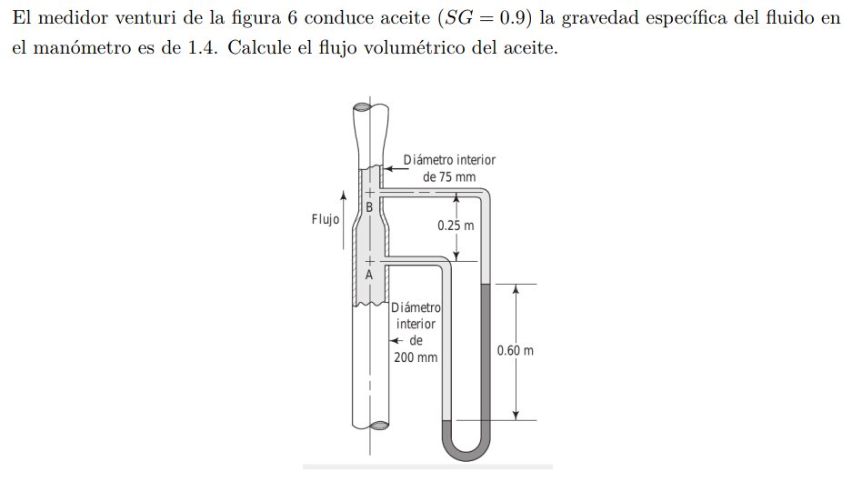

#Problema 6

Relacion de velocidades medidor venturi

$Q_A = Q_B$

$v_A * pi * ((0.2[m])/2)^2 = v_B * pi * ((0.075[m])/2)^2$

$v_A = (v_B * pi * ((0.075[m])/2)^2) / (pi * ((0.2[m])/2)^2)$

$v_A = v_B * 0.140625$

Diferencia de presión

$p_A + gamma_(oil) * 0.60[m] - gamma_(man) * 0.60[m] - gamma_(oil) * 0.25[m] = p_B$

$p_B - p_A = gamma_(oil) * 0.60[m] - gamma_(man) * 0.60[m] - gamma_(oil) * 0.25[m]$

$p_B - p_A = gamma_(oil) (0.60[m] - 0.25[m]) - gamma_(man) * 0.60[m]$

$p_B - p_A = 0.9 * 9800[N/m^3] * 0.35[m] - 1.4 * 9800[N/m^3] * 0.60[m]$

$p_B - p_A = 3087[Pa] - 8232[Pa] = -5145[Pa]$

Bernoulli entre A y B

$p_A / gamma_(oil) + 1/2 * (v_A)^2 / g = p_B / gamma_(oil) + 1/2 * (v_B)^2 / g + 0.25[m]$

$gamma_(oil)/(2 * g) ( (v_A)^2 - (v_B)^2 )- 0.25[m]= p_B - p_A$

$(0.9 * 9800[N/m^3])/(2 * 9.81[m/s^2]) ( (v_B * 0.140625)^2 - (v_B)^2 )- 0.25[m]= -5145[Pa]$

$v_B = 3.41692[m/s]$

Flujo

$Q = v_b * A_B$

$Q = 3.41692[m/s] * pi * ((0.075[m])/2)^2 = 0.015095[m^3/s]$

Ese resultado difiere del de el solucionario del profe, pero no tengo tiempo para confirmar cual esta bueno