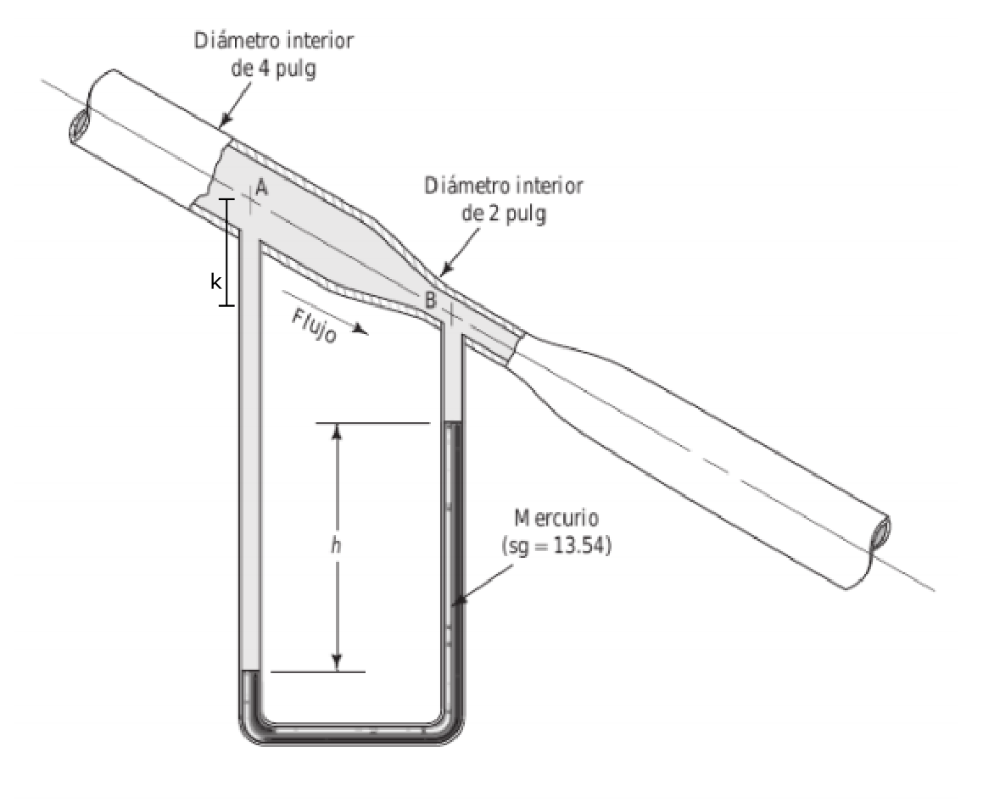

#Problema 7

Relacion de velocidades

$Q_A = Q_B$

$v_A * A_A = v_B * A_B$

$v_A * pi * ((0.1016[m])/2)^2 = v_B * pi * ((0.0508[m])/2)^2$

$v_A = (v_B * pi * ((0.0508[m])/2)^2) / (pi * ((0.1016[m])/2)^2)$

$v_A = v_B * 0.25$

Diferencia de presión

$p_A + y_(oil) * k + y_(oil) * h - y_(Hg) * h = p_B$

$y_(oil) * k + y_(oil) * h - y_(Hg) * h = p_B - p_A$

$k + h - (y_(Hg) * h)/y_(oil) = (p_B - p_A) / y_(oil)$

Bernoulli entre A y B

$p_A / gamma_(oil) + 1/2 * (v_A)^2 / g + k = p_B / gamma_(oil) + 1/2 * (v_B)^2 / g$

$(p_B - p_A) / gamma_(oil) = ((v_A)^2 - (v_B)^2) / (2 * g) + k$

Igualar diferencia de presión

$k + h - (y_(Hg) * h)/y_(oil) = ((v_A)^2 - (v_B)^2) / (2 * g) + k$

$h - (y_(Hg) * h)/y_(oil) = ((v_A)^2 - (v_B)^2) / (2 * g)$

$0.7112[m] - 13.54/0.9 * 0.7112[m] = ((v_B * 0.25)^2 - (v_B)^2) / (2 * 9.81[m/s^2])$

$v_B = 14.458[m/s]$

$Q = v_B * A_B$

$Q = 14.458[m/s] * pi * ((0.0508[m])/2)^2 = 0.0293[m^3/s]$

Trabajando a partir de

$h - (y_(Hg) * h)/y_(oil) = ((v_A)^2 - (v_B)^2) / (2 * g)$

$h - 13.54/0.9 * h = ((0.762[m/s])^2 - (3.048[m/s])^2) / (2 * 9.81[m/s^2])$

$h = 0.031608[m]$