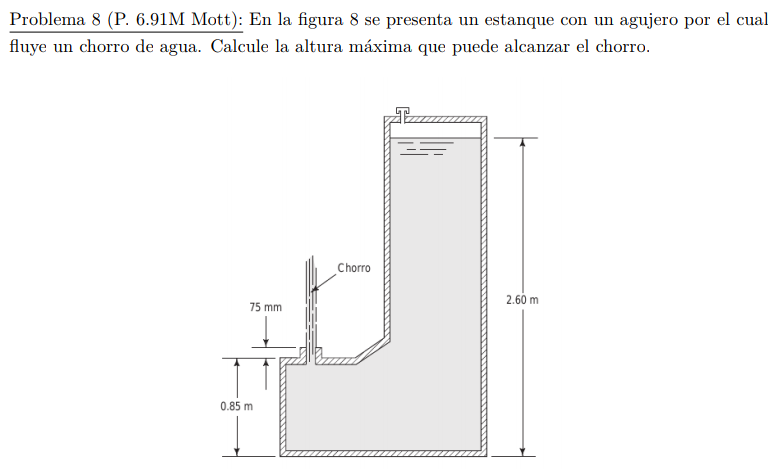

#Problema 8

Velocidad de agua en salida

$1.675[m] = 1/2 * (v^2) / g$

$v = sqrt(1.675[m] * 2 * 9.81[m/s^2])$

$v = 5.732[m/s]$

Encontrar altura maxima

$h = 1/2 * v^2/g$

El chorro llega a la altura de la superficie