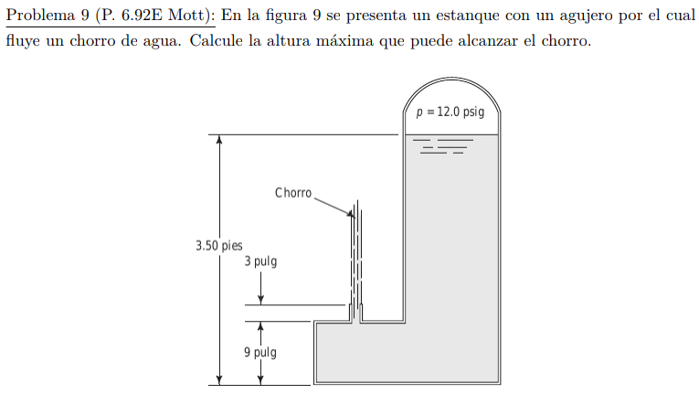

#Problema 9

$p_(s up) / gamma_w + h = 1/2 * v^2 / g$

$(82737.1[Pa]) / (9800[N/m^3]) + (1.0668[m] - 0.3048[m]) = 1/2 * v^2 / (9.81[m/s^2])$

$v = 13.439[m/s]$

Altura desde base del chorro

$h = 1/2 * v^2 / g$

$h = 1/2 * (13.439[m/s])^2 / (9.81[m/s^2]) = 9.205[m]$