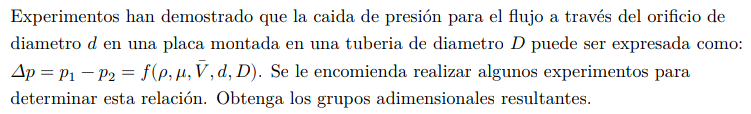

#Problema 1

$$		|$Deltap$|$rho$	|$mu$	|$barv$	|$d$	|$D$
--		|--		|--		|--		|--		|--		|--
$M$		|$1$	|$1$	|$1$	|$0$	|$0$	|$0$
$L$		|$-1$	|$-3$	|$-1$	|$1$	|$1$	|$1$
$T$		|$-2$	|$0$	|$-1$	|$-1$	|$0$	|$0$

Rango de matriz

$|[ 1, 0, 0],
  [-1, 1, 1],
  [-1,-1, 0]| = 1 * (-1 * -1) = 1 != 0$

$j = 3$

Cantidad de grupos adimensionales

$n - j = 6 - 3 = 3$

Variables independientes = $mu, d$

Variables de repetición = $rho, barv, D$

$Pi_1 = Deltap * rho^a v^b D^c = (M^1L^-1T^-2) * (M^1L^-3)^a * (L^1T^-1)^b * (L^1)^c$

${:
	{:
		[L:, -1 - 3a + b + c = 0],
		[M:, 1 + a = 0],
		[T:, -2 - b = 0]
	}
	{:
		[a = -1],
		[b = -2],
		[c = 2 - 3 + 1 = 0]
	:}
:}$

$Pi_1 = (Deltap) / (rho * v^-2)$

$Pi_2 = mu * rho^a v^b D^c = (M^1L^-1T^-1) * (M^1L^-3)^a * (L^1T^-1)^b * (L^1)^c$

${:
	{:
		[L:, -1 - 3a + b + c = 0],
		[M:, 1 + a = 0],
		[T:, -1 - b = 0]
	}
	{:
		[a = -1],
		[b = -1],
		[c = 1 - 3 + 1 = -1]
	:}
:}$

$Pi_2 = mu / (rho * v * D) = Re^-1$

A lo choro nomas damos vuelta $Pi_2$ para que quede como reynolds

$Pi_2 = Re = (rho * v * D) / mu$

$Pi_3 = d * rho^a v^b D^c = (L^1) * (M^1L^-3)^a * (L^1T^-1)^b * (L^1)^c$

${:
	{:
		[L:, 1 - 3a + b + c = 0],
		[M:, 0 + a = 0],
		[T:, 0 - b = 0]
	}
	{:
		[a = 0],
		[b = 0],
		[c = -1]
	:}
:}$

$Pi_3 = d / D$