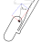

	
		Sistemas mecánicos
	
	 
	<b>
		
			Tarea 1: Tren de aterrizaje
		
		 
			Germán Quijada
		
	</b>

 

####Análisis de mecanismo
Se solicita analizar el mecanismo del tren de aterrizaje de un avión con los siguientes datos.
 Velocidad apertura cilindro hidráulico: $2[(cm)/s]$
 Masa barra 6: $m_6 = 55[kg]$
 Momento de inercia: $I_6 = 1.3[(kg)/m^2]$
 $V_A = V_D = V_G = 0[m/s]$

####Escala Inkscape

Distancia real $ED = 40[cm] = 17.89[mm_text(Inkscape)] => 2.23589[(cm)/(mm_text(Inkscape))]$

Velocidad real $V_(B_(3//2)) = 2.0[(cm)/s] = 25.23[mm_text(Inkscape)] => 0.07927[((cm)/s)/(mm_text(Inkscape))]$

####Determinar velocidad angular en la barra 6

Comenzando desde arriba, se puede encontrar el centro de rotación $O_13$

$O_14 &nbsp; O_34 &nbsp; O_13$
 $O_12 &nbsp; O_23 &nbsp; O_13$

De esta forma con un triangulo de velocidades se puede encontrar la velocidad $V_B$

$V_B = V_(B_(3//2)) + omega_2 xx r_(B//O_12)$
 $V_B = omega_3 xx r_(B//O_13)$

$V_B = 25.92 * 0.07927 = 2.05[(cm)/s]$

Luego, la velocidad angular $omega_3$

$V_B = omega_3 xx r_(B//O_13)$

$2.05[(cm)/s] = omega_3 * 39.14 * 2.23589$

$omega_3 = 0.02343[(rad)/s] ⟳$

Los cuerpos 3 y 4 están unidos en $C$

$omega_3 * bar(O_13C) = omega_4 * bar(O_14C)$

$0.02343[(rad)/s] * 43.47 * 2.23589 = omega_4 * 9.07 * 2.23589$

$omega_4 = 0.11229[(rad)/s] ⟲$

Se prosigue analizando los centros instantáneos

$O_16 &nbsp; O_56 &nbsp; O_15$
 $O_14 &nbsp; O_45 &nbsp; O_15$

Los cuerpos 4 y 5 comparten el punto $E$

$omega_4 * bar(O_14O_45) = omega_5 * bar(O_15O_45)$

$0.11229[(rad)/s] * 18.26 * 2.23589 = omega_5 * 3.48 * 2.23589$

$omega_5 = 0.58920 [(rad)/s] ⟳$

Los cuerpos 5 y 6 comparten el punto $F$

$omega_5 * bar(O_15O_56) = omega_6 * bar(O_16O_56)$

$0.58920[(rad)/s] * 8.03 * 2.23589 = omega_4 * 13.29 * 2.23589$

$omega_6 = 0.35600[(rad)/s] ⟳$

 

####Determinar aceleración angular en la barra 6

$A_B = ubrace(omega_2 xx (omega_2 xx bar(AB)))_text(normal) + ubrace(alpha_2 xx bar(AB))_text(tangencial) + ubrace(2 * omega_2 xx V_B _3//2)_text(coriolis)$

$A_C = A_B + ubrace(omega_3 xx (omega_3 xx bar(BC)))_text(normal) + ubrace(alpha_3 xx bar(BC))_text(tangencial)$

$A_C = ubrace(omega_4 xx (omega_4 xx bar(DC)))_text(normal) + ubrace(alpha_4 xx bar(DC))_text(tangencial)$

Ya que $omega_2 = omega_3$ y $alpha_2 = alpha_3$ entonces

$A_C = ubrace(omega_3 xx (omega_3 xx bar(AC)))_text(0.025284 cm/s^2) + ubrace(alpha_3 xx bar(AC))_text(tangencial) + ubrace(2 * omega_2 xx V_B _3//2)_text(0.09372 cm/s^2)$

$A_C = ubrace(omega_4 xx (omega_4 xx bar(DC)))_text(0.25401 cm/s^2) + ubrace(alpha_4 xx bar(DC))_text(tangencial)$

$A_C = 0.30233[(cm)/s^2]$

$alpha_4 = 0.00808492[(rad)/s^2] ⟳$

$A_E = ubrace(omega_4 xx (omega_4 xx bar(DE)))_text(0.51479 cm/s^2) + ubrace(alpha_4 xx bar(DE))_text(0.33008 cm/s^2)$

$A_F = A_E + ubrace(omega_5 xx (omega_5 xx bar(EF)))_text(4.84351 cm/s^2) + ubrace(alpha_5 xx bar(EF))_text(tangencial)$

$A_F = ubrace(omega_6 xx (omega_6 xx bar(GF)))_text(3.76595 cm/s^2) + ubrace(alpha_6 xx bar(GF))_text(tangencial)$

$A_F = 4.41282[(cm)/s^2]$

$alpha_6 = 0.0774064[(rad)/s^2] ⟳$

 
 
 
 
 
 
 
 
 

####Determinar fuerza sobre pistón

Primero se necesita la aceleración en el centro de masa
$A_(cm) = ubrace(omega_6 xx (omega_6 xx bar(Gcm)))_text(9.42197 cm/s^2) + ubrace(alpha_6 xx bar(Gcm))_text(5.75465 cm/s^2)$

$A_(cm) = 11.04036[(cm)/s^2]$

Se simplifica el torque y el peso sobre el centro de masa en una sola fuerza de un sistema equivalente

$I * alpha = 1.3[N/m^2] * 0.0774064[(rad)/s^2] = 0.10062 [N * m]$

$m * A_(cm) = 55[kg] * 0.1104036[m/s^2] = 6.072198[N]$

$d = (I * alpha) / (m * A_(cm)) = 0.01657[m] = 1.657[cm]$

Se conoce la dirección de la fuerza $F_56$ ya que es una barra conectada en dos puntos, y la $F_16$ para completar el triangulo

$F_56 = 27.06[N]$

La fuerza $F_56$ se transmite por la barra 5 hasta el cuerpo 4 como $F_45$

$F_34 = 58.39[N]$

