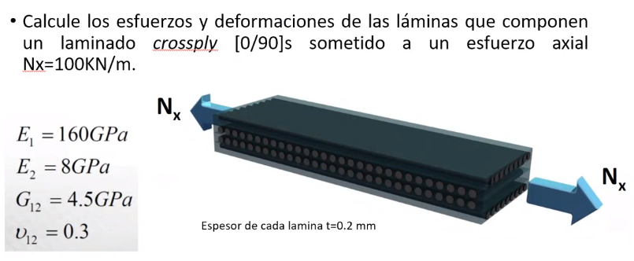

##Problema 1



Laminas $0, 90, 90, 0$

###a) Encontrar deformación del laminado

Tensor de rigidez de cada lamina

En laminas se aplica que

$v_12 / E_1 = v_21 / E_2 => 0.3 / (160[GPa]) = v_21 / (8[GPa]) => v_21 = 0.015$

$[Q]=
[
	[
		 E_1 / (1 - v_12 * v_21), (v_12 * E_2) / (1 - v_12 * v_21), 0
	],
	[
		(v_12 * E_2) / (1 - v_12 * v_21), E_2 / (1 - v_12 * v_21), 0
	],
	[
		0, 0, G_12
	]
]
=
[
	[160.72, 2.41, 0
	],
	[2.41, 8.04, 0
	],
	[0, 0, 4.5
	]
][GPa]
$

```javascript
E1 = 160;
E2 = 8;
G12 = 4.5;
v12 = 0.3;
v21 = 0.015;
Q = [
	[E1/(1-(v12*v21)), v12*E2/(1-v12*v21), 0];
	[v12*E2/(1-v12*v21), E2/(1-(v12*v21)), 0];
	[0, 0, G12]
]
```

Las laminas 1 y 4 estan en la misma orientación $[Q] = [Q]_1 = [Q]_4$

Las laminas 2 y 3 estan a $90°$ $[Q]_90 = [Q]_2 = [Q]_3$

$[Q]_90 = [T]_90^-1 * [Q] * [T']_90$ Donde

$[T]^-1 =
[
	[cos^2(theta), sin^2(theta), -2 * cos(theta) * sin(theta)
	],
	[sin^2(theta), cos^2(theta), 2 * sin(theta) * cos(theta)
	],
	[cos(theta) * sin(theta), -sin(theta) * cos(theta), cos^2(theta) - sin^2(theta)
	]
]
$

```javascript
a = deg2rad(90);
T = [
	[cos(a)^2, sin(a)^2, 2*cos(a)*sin(a)];
	[sin(a)^2, cos(a)^2, -2*sin(a)*cos(a)];
	[-cos(a)*sin(a), sin(a)*cos(a), cos(a)^2-sin(a)^2]
];
inv(T)
```

$[T'] = 
[
	[cos^2(theta), sin^2(theta), cos(theta) * sin(theta)
	],
	[sin^2(theta), cos^2(theta), -sin(theta) * cos(theta)
	],
	[-2 * cos(theta) * sin(theta), 2* sin(theta) * cos(theta), cos^2(theta) - sin^2(theta)
	]
]
$

```javascript
a = deg2rad(90);
T_prima = [
	[cos(a)^2, sin(a)^2, cos(a)*sin(a)];
	[sin(a)^2, cos(a)^2, -sin(a)*cos(a)];
	[-2*cos(a)*sin(a), 2*sin(a)*cos(a), cos(a)^2-sin(a)^2]
]
```

Entonces

$[Q]_90 = [T]_90^-1 * [Q] * [T']_90 = 
[
	[8.04, 2.41, 0
	],
	[2.41, 160.72, 0
	],
	[0, 0, 4.5
	]
][GPa]
$
```javascript
Q_90 = inv(T) * Q * T_prima
```

$[N] = [A] * epsilon^0$

$[A] = sum_(k=1)^n ubrace(h_k - h_(k-1))_(text(espesor)) * [Q]_k = 2 t([Q]_0 + [Q]_90) = 
[
	[0.0675, 0.00193, 0
	],
	[0.00193, 0.0675, 0
	],
	[0, 0, 0.0036
	]
][GPa*m]
$

```javascript
A = 2 * 0.0002 * (Q + Q_90)
```
Este show funciona pero no estoy seguro si es legal

$[N][(kN)/m] = [A][GPa * m] * [epsilon]$

$[N][(kg) / (s^2)] * 10^3 = [A][(kg) / (s^2)] * 10^9 * [epsilon] // * 1/(10^3)$

$[N] = [A] * 10^6 * [epsilon]$

$[A]^-1 * 1/10^6 * [N] = [epsilon] = 
[
	[0.00148],
	[-0.000042],
	[0]
]
$

```javascript
epsilon = inv(A) / 10^6 * [100; 0; 0]
```

$[epsilon]$ corresponde a la deformación en el eje estructural

###b) Esfuerzo de cada lamina en eje estructural

$[sigma]_k = [Q]_k * [epsilon]$

$[sigma]_0 = [Q]_0 * [epsilon] = 
[
	[0.238],
	[0.00323],
	[0]
][GPa]
$

$[sigma]_90 = [Q]_90 * [epsilon] = 
[
	[0.0118],
	[-0.00323],
	[0]
][GPa]
$

```javascript
Q * epsilon
sigma_90 = Q_90 * epsilon
```

###c) Esfuerzo de cada lamina en eje de cada lamina

Laminas 1 y 4 ya estan en el eje de lamina

$ubrace([sigma])_text(laminal) = [T]_90 * ubrace([sigma])_text(estructural) = 
[
	[-0.00323],
	[0.0118],
	[0]
][GPa]
$
```javscript
T * sigma_90
```